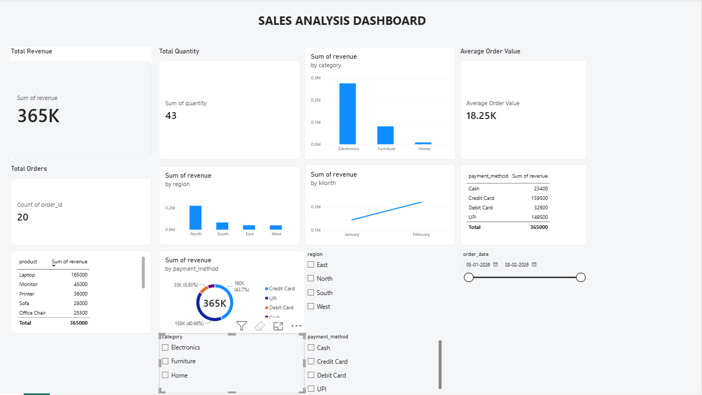

# Retail Sales Analytics 📊

An end-to-end retail sales analytics project using **SQL, Python, and Power BI** to analyze sales performance, revenue, products, regions, categories, and payment methods.

---

## 📌 Project Overview

This project analyzes a retail sales dataset to identify important business insights such as:

- Total revenue and orders
- Product-wise sales performance
- Category-wise revenue
- Region-wise revenue
- Payment method performance
- Monthly sales trends
- Average Order Value (AOV)

The project demonstrates a complete data analytics workflow from raw data to business insights and interactive dashboard visualization.

---

## 🛠️ Tools & Technologies

- **Python** – Pandas, NumPy, Matplotlib
- **SQL** – Data analysis and business queries
- **Power BI** – Interactive dashboard and visualization
- **CSV** – Sales dataset
- **GitHub** – Project documentation and version control

---

## 📂 Project Structure

```text
Retail-Sales-Analytics/
│
├── README.md
├── sales.csv
├── sales_analysis.py
├── sales_analysis.sql
├── Sales_Analysis_Dashboard.pbix
└── dashboard.png
```

---

## 📊 Key KPIs

| KPI | Value |
|---|---:|
| Total Orders | 20 |
| Total Quantity | 43 |
| Total Revenue | ₹365,000 |
| Average Order Value | ₹18,250 |

---

## 📈 Dashboard Preview



---

## 🔍 Key Analysis

### Sales Performance
Analyzed total revenue, total orders, quantity sold, and average order value.

### Product Analysis
Identified product-wise sales performance and revenue contribution.

### Category Analysis
Compared revenue across Electronics, Furniture, and Home categories.

### Regional Analysis
Analyzed sales performance across different regions.

### Payment Method Analysis
Compared revenue generated through Cash, Credit Card, Debit Card, and UPI.

### Monthly Trend
Analyzed monthly revenue trends to understand sales movement over time.

---

## 💡 Business Insights

- Electronics generated the highest revenue among the categories.
- North region contributed the highest regional revenue.
- UPI and Credit Card were major payment methods by revenue.
- The dashboard provides a quick overview of overall sales performance.
- AOV helps understand the average revenue generated per order.

---

## 🚀 Project Workflow

```text
Raw Sales Data
      ↓
Data Analysis using Python
      ↓
Business Queries using SQL
      ↓
Dashboard Creation using Power BI
      ↓
Business Insights
```

---

## 👩‍💻 Author

**Pratiksha Jaware**

Aspiring Data Analyst | Python | SQL | Power BI
